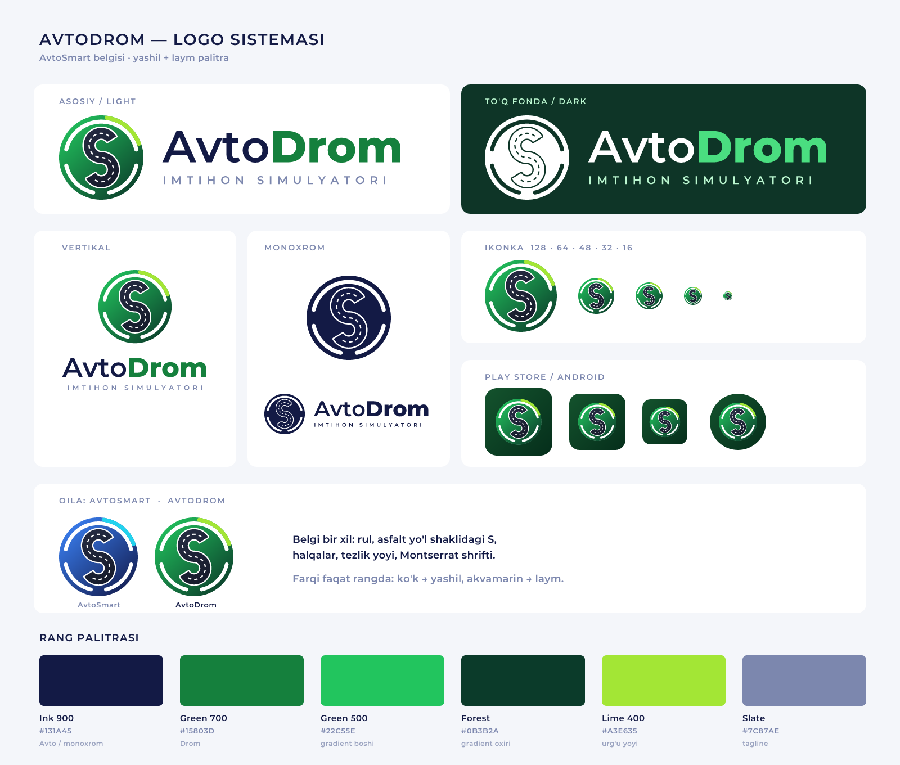

# AvtoDrom — logo paketi

AvtoSmart belgisining o'zi — rul ichida asfalt yo'l shaklidagi **S**, rul
halqalari va tezlik yoyi. Farqi faqat rangda: ko'k → **yashil**, akvamarin →
**laym**. Yozuv: "Avto" — AvtoSmart siyohrangi, "Drom" — yashil.



## Rang palitrasi

| Nom | HEX | Qayerda |
|---|---|---|
| Ink 900 | `#131A45` | "Avto" (AvtoSmart bilan umumiy), monoxrom |
| Green 700 | `#15803D` | "Drom" |
| Green 500 | `#22C55E` | disk gradienti boshi |
| Forest | `#0B3B2A` | disk gradienti oxiri |
| Lime 400 | `#A3E635` | urg'u (tezlik yoyi) |
| Slate | `#7C87AE` | tagline (AvtoSmart bilan umumiy) |
| Asfalt | `#262C43 → #141928` | yo'l qoplamasi |
| Ilova foni | `#14532D → #052E1B` | app icon / adaptive fon |

To'q fonda: matn oq, "Drom" `#4ADE80`, tagline `#BBF7D0`.

## Fayllar

```
svg/         – vektor manba (matn konturga aylantirilgan, mask yo'q)
png/, webp/  – ikonkalar 16…1024px, logotiplar 600/1200/2400px
play-store/  – app-icon-512.png, feature-graphic-1024x500.png
android/     – adaptive (foreground/background/monochrome 432px) + legacy mipmap
godot/       – Godot loyihasi kutadigan nomlar bilan (icon.png, icon_192, icon_adaptive_*, icon.ico)
windows/     – avtodrom.ico (16…256, kichiklari soddalashtirilgan)
favicon/     – sayt uchun
PREVIEW.png  – umumiy ko'rinish varag'i
```

| Fayl | Ishlatish joyi |
|---|---|
| `avtodrom-logo-horizontal` | asosiy variant |
| `avtodrom-logo-horizontal-notag` | tor joylar |
| `avtodrom-logo-vertical` | avatar, banner, sertifikat |
| `avtodrom-logo-white` | to'q fonda |
| `avtodrom-logo-mono` | bir rangli bosma |
| `avtodrom-icon` | 48px va undan katta |
| `avtodrom-icon-simple` | 32px va kichik (uzuq chiziqsiz) |
| `avtodrom-app-icon` | ilova ikonkasi (kvadrat, Play Store/Android o'zi yumaloqlaydi) |

## Google Play

- **Ilova ikonkasi**: `play-store/app-icon-512.png` (512×512, 32-bit PNG).
- **Feature graphic**: `play-store/feature-graphic-1024x500.png` (alfa kanalsiz).
- Adaptive ikonka: belgi 72dp ko'rinadigan maydonning 68% ida — xavfsiz zona
  (66dp) ichida, har qanday niqob shaklida kesilmaydi.
- `ic_launcher_monochrome.png` — Android 13+ "themed icons" uchun.

## Qayta yaratish

```bash
pip install fonttools resvg-py pillow
python brand/generate.py
```

Ranglar `generate.py` boshidagi konstantalarda. Belgi shakli
`_src/avtosmart-icon.svg` va `_src/avtosmart-icon-white.svg` dan olinadi —
AvtoSmart belgisi o'zgarsa, shu ikki faylni yangilab qayta ishga tushiring.

## Shrift

Montserrat SemiBold (Avto, tagline) + ExtraBold (Drom), OFL —
`_src/` da (Google Fonts `Montserrat[wght]` dan instance qilingan).
